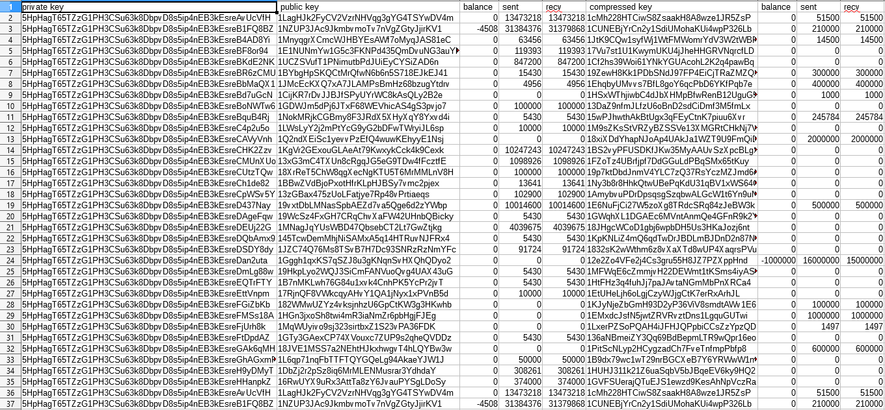

# hashsift

#### 💱 Find bitcoin wallets with balance

## About

The goal of hashsift is finding "leaked" wallets. With the help of previous research and current technology it is quite simple to implement and check wallets online. The only real issue is doing the following in a quick amount of time.

There is no guarantee that this will always find wallets.

## Known Issues

* Currently under-going constant re-structuring since the first several versions of (19/DEC/2017)
* Site to access wallets from is now offline however method remains universal

## Examples

```
usage: hashsift.py [-h] [-c] [-c_min CUSTOM_MIN] [-c_max CUSTOM_MAX] [-i] [-r]
                   [-f] [-lo] [-mi] [-hi] [-b] [-w] [-t THREADS]
example: python hashsift.py -i -t 4
example: python hashsift.py -c -c_min 0.02 -c_max 0.04 -t 4
example: python hashsift.py -lo
example: python hashsift.py -w
example: python hashsift.py

commands:
-c custom random generation between custom elements
-c_min custom generation with min element
-c_max custom generation with max element

-i iterates from 0% to 100%

-r random generation between 0% and 100%

-f front random generation between 0% and 10%
-lo low random generation between 23% and 27%
-mi middle random generation between 48% and 52%
-hi high random generation between 73% and 77%
-b back random generation between 90% and 100%

-w wild card picks a random argument per each thread

threads:
-t threads count
```

## Demos

sample csv output:


## Requirements
+ [directory.io](https://github.com/saracen/directory.io)
+ (Recommended) Python 3.7.0+
+ (Recommended) Windows (7.1 - 10)

## Developer

* ["dovezp"][ref-self]

## License

This project is licensed under the [LGPL (Version 3)][ref-LGPL]. See the [LICENSE.md](./LICENSE.md) file for details.

[ref-self]: https://github.com/dovezp
[ref-LGPL]: https://tldrlegal.com/license/gnu-lesser-general-public-license-v3-(lgpl-3)
